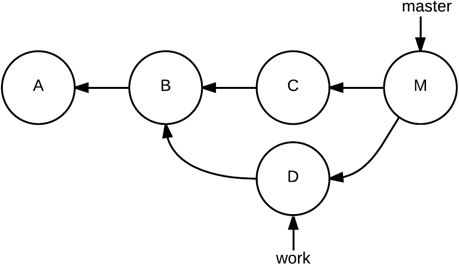

#Conhecendo um pouco mais sobre o GIT
##GIT

- O que é git
- Como funciona o git
- Conceito base do git
- Comandos do git

## O que é GIT ?
- Git é uma ferramenta que permite que trabalhemos em equipe com um conjunto de arquivos
- Não está atrelado somente a desenvolvimento de sistemas.
- Existem várias outras formas para compartilhamento de código.
  GIT é a mais utilizada.

## Como funciona o GIT
- Compartilha o principio de que __branches__ que são "Ramificações" de arquivos, podem ser compartilhados dentro de um projeto
### E o que é uma branch?
- Branch nada mais é que um ponteiro baseado em um momento do projeto GIT
- Existe uma branch master no seu projeto inicial.



### E como é o funcionamento diário com GIT
- No dia a dia de desenvolvimento de sistemas utilizando GIT nós podemos:
    - Criar um projeto git vazio
    - Clonar um projeto existente
    - Criar branches.
    - stag mudanças
    - Entregar mudanças em branch
    - Copiar mudanças
    - Mergear código com código existente em outra branch.

## E como eu posso fazer isso tudo?
Antes de mais nada precisamos de duas coisas:
- Instalar o git
- Criar uma conta em algum serviço de repositório de código
### Instalar o Git
#### Windows
- Seguir os passos definido em:
  https://git-scm.com/download/win

#### Linux
##### Ubuntu
```
sudo apt install git-all
```

##### CentOS
```
sudo dnf install git-all
```

#### MacOS
- Seguir os passos definidos em:
  https://git-scm.com/download/mac
### Comandos:
#### Criar um projeto git vazio
```
git init
``` 

#### Clonar um projeto
```
git clone <endereço git>
``` 

#### Criar uma branch
```
git checkout -b <nome da branch>
```

##### Remover uma branch
```
git branch -d <nome da branch>

```
##### Publicar uma branch
```
git push --set-upstream origin <nome da branch>

``` 
#### Preparar commit
```
git add ...
```
```
git commit ...
```
#### Publicando alteração numa branch remota
```
git push ...
```
#### Copiando da árvore remota ou de outras árvores
```
git pull ...
```
#### Realizando merge entre branches
```
git merge ...
```


### Existe algo que possa-me ajudar com todos esses comandos?
- Existem diversas ferramentas gráficas que auxiliam na utilização do GIT
    - git-scm (https://git-scm.com/downloads)
    - GitKraken (https://www.gitkraken.com/)
    - A maioria das ferramentas de edição de código já vem com suporte a GIT
        - Incluindo o nosso amigo inteligente intellij