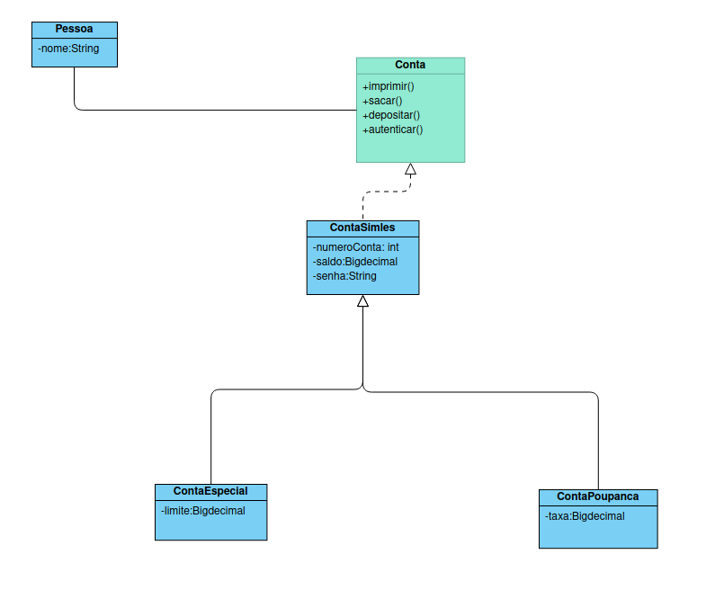

# Projeto de POO

## Baseado no diagrama de classe

Criar estrutura para que uma pessoa consiga fazer as operações de deposito e saque dos dois tipos de conta que ela possui.

## Regras:
 #### Conta especial
  - Ao criar uma nova conta do tipo especial, esta tem limite de 200 reais.
 #### Conta Saldo
  - Em todas as operações é cobrada uma taxa de 0.07 em cada operação.

